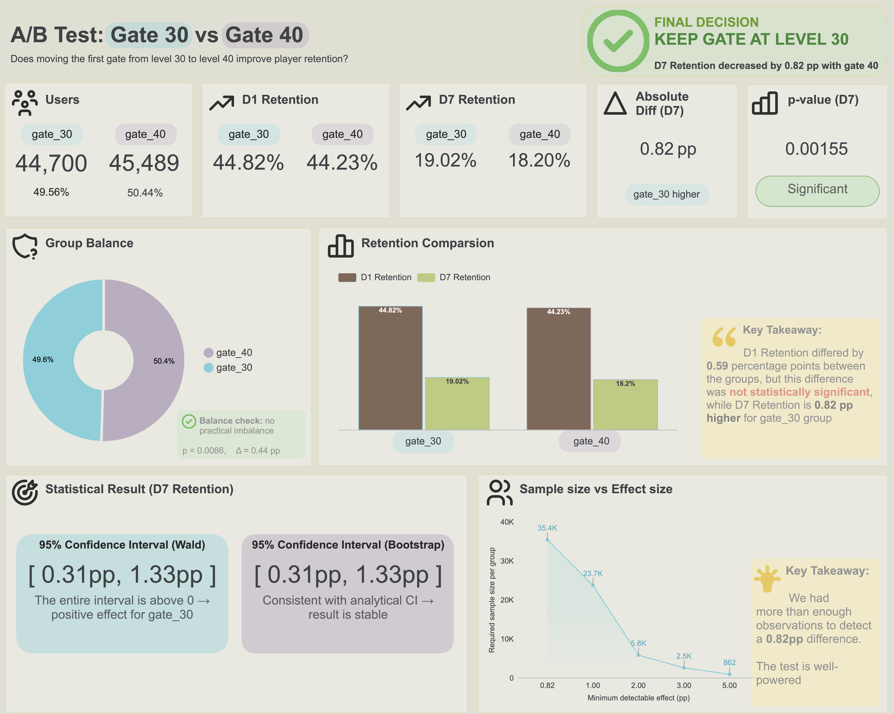

# A/B Test: Cookie Cats Gate Placement

Does moving the first progression gate in a mobile game from level 30 to level 40 improve player retention? A full statistical A/B test analysis - experiment design, sanity checks, hypothesis testing, confidence intervals, bootstrap validation and sample size planning — on the [Mobile Games A/B Testing (Cookie Cats)](https://www.kaggle.com/datasets/yufengsui/mobile-games-ab-testing) dataset.

## 🔗 Live dashboard

[Looker Dashboard](https://datastudio.google.com/reporting/5623e79b-2615-45a7-9344-2c3ab3a250bc)

### 📊 Dashboard Preview



## 📓 Google Colab Notebooks

[Mobile Games A/B Testing - Cookie Cats](https://colab.research.google.com/drive/1dRCcglzK2DlEoAnQyg3gALiN3I6P1T9p?usp=sharing)

---

## 📌 Project goals

The experiment tests whether moving the first gate from level 30 to level 40 affects player engagement and retention. The goal is to determine whether changing the gate position leads to a meaningful difference in player retention:

- **Control (gate_30)** - gate appears at level 30
- **Treatment (gate_40)** - gate appears at level 40
- **Primary metric:** D7 Retention
- **Secondary metric:** D1 Retention
- **Supporting metric:** Total game rounds played
---

## 🗂️ Repository structure

```
├── notebooks/
│   └── cookie_cats_ab_testing.ipynb
│
├── images/
│   └── Cookie_Cats_A_B.png
│
└── README.md
```

---

## 🧱 Data Architecture

```
Kaggle CSV (Cookie Cats)
      │
      ▼
Google Colab
      │
      ├── Data quality checks (nulls, duplicates, group balance, outliers)
      ├── Two-proportion z-test, Wald CI, bootstrap CI
      ├── Mann-Whitney U test
      ├── Sample size / MDE
      │
      ▼
Aggregated tables to CSV
      │
      ▼
    Looker
```

---

## 🛠️ Tech stack

- **Python** - Google Colab
- **Looker Studio** - dashboard and data visualization


---

## 🔍 Key results

- **D7 retention difference:** 0.82 pp (gate_30 higher) - statistically significant
- **95% CI (Wald):** [0.31 pp, 1.33 pp]
- **95% CI (bootstrap, 10 000 samples):** [0.31 pp, 1.33 pp] - identical to the analytical CI, confirming the result is not an artifact
- **D1 retention difference:** 0.59 pp - not statistically significant
- **Group balance:** p = 0.0086 (technically significant at a=0.05) but the actual deviation is small (49.56% vs 50.44%, 0.44 pp difference) - not practically meaningful
- **Sample size:** the actual sample (~45K/group) was well above the ~35.4K/group required to detect the observed 0.82 pp effect at 80% power - the test was well powered, not a false positive from an underpowered design

---

## ✅ Final decision

**Keep the gate at level 30.** Moving it to level 40 is associated with a statistically significant *decrease* in D7 retention. The effect is modest in absolute size (0.82 pp), but consistently negative across two independent CI methods.
